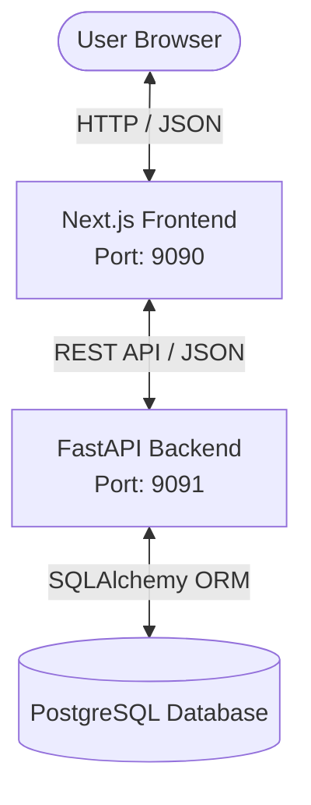
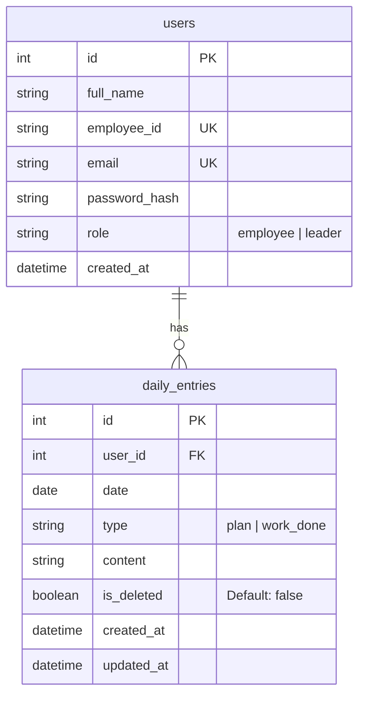
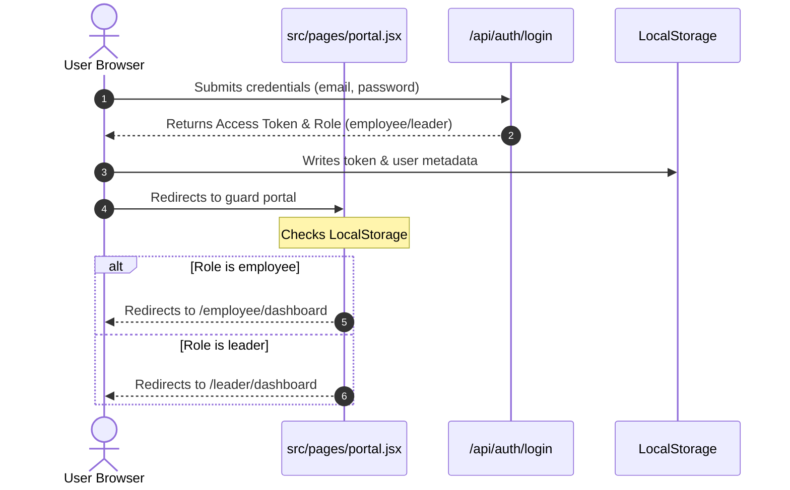
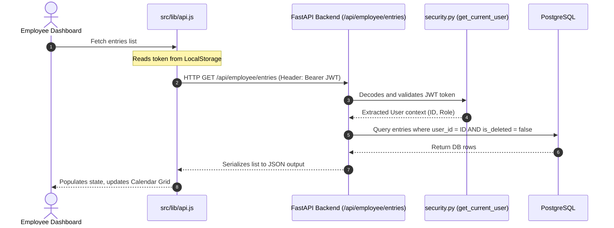

# All About Pocket Dairy: The Complete Technical Guide

Pocket Dairy is a full-stack, role-based daily progress tracking application designed for workspace environments. It enables **Employees** to document their daily plans and work done on a visual calendar interface, while granting **Leaders** read-only monitoring access to review the entries of their team members.

This document serves as the absolute single-source reference manual explaining the tech stack, project architecture, workflows, file-by-file logic, and database schemas.

---

## 1. Tech Stack Overview

The application is split into a modern decoupled stack: a high-performance Python API backend and a responsive Next.js React frontend.



### Backend (API Services)
*   **FastAPI (Python 3.11+)**: Selected for its asynchronous capabilities, automated documentation (Swagger), and type safety via Pydantic.
*   **SQLAlchemy ORM**: For database modeling, transaction management, and query construction.
*   **PostgreSQL**: relational database engine storing user records and diary entries.
*   **Alembic / Auto-migration**: FastAPI triggers automatic schema creation upon start via SQLAlchemy's metadata bind.
*   **Uvicorn**: Asynchronous Server Gateway Interface (ASGI) running the FastAPI application.
*   **Passlib (with bcrypt)**: Used to secure passwords via hashing algorithms.
*   **Python-Jose**: Implements JSON Web Token (JWT) signatures and claims validation.

### Frontend (User Interface)
*   **Next.js 14 (Pages Router)**: Provides optimized compilation, dynamic routing, and fast client-side rendering.
*   **React**: Modular view component architecture and state hooks (`useState`, `useEffect`).
*   **Tailwind CSS & Custom CSS**: Tailwind supplies layout utilities, while a structured `globals.css` defines the typography, color scheme, complex components (Calendar grids), and animations.
*   **Date-fns**: Date manipulation utility used to construct calendar grids and formats.

---

## 2. Global Directory Structure

Here is how the project files are physically organized on disk:

```text
Pocket Dairy/
├── run.js                       # Unified launcher script
├── README.md                    # Installation & startup readme
├── all_about_pocket_dairy.md    # This technical guide
│
├── backend/                     # Python Backend Directory
│   ├── .env                     # Secrets & DB configuration
│   ├── database.py              # DB Engine & Session Manager
│   ├── main.py                  # API entry point & CORS configuration
│   ├── security.py              # JWT generation/decoding & Hashing helpers
│   ├── requirements.txt         # Python package dependencies
│   ├── models/
│   │   └── schemas.py           # DB Models & Pydantic Validation schemas
│   └── routers/
│       ├── auth.py              # Registration, Login, Token generation routes
│       ├── employee.py          # Create, view, soft-delete entries
│       └── leader.py            # Get employees list & read-only entries
│
└── frontend/                    # Next.js Frontend Directory
    ├── package.json             # NPM dependencies & scripts
    ├── postcss.config.js        # PostCSS configuration for Tailwind
    ├── tailwind.config.js       # Tailwind CSS configuration
    └── src/
        ├── lib/
        │   └── api.js           # API request client wrapper
        ├── styles/
        │   └── globals.css      # Core style sheet and responsive layout rules
        ├── components/
        │   ├── CalendarGrid.jsx # Visual grid rendering calendar months
        │   ├── EmployeeModal.jsx# Editor for entries (Plan / Work Done)
        │   ├── LeaderModal.jsx  # Read-only viewer for leaders
        │   └── Sidebar.jsx      # Navigation bar with profile header
        └── pages/
            ├── _app.jsx         # App wrapper loading global styles
            ├── index.jsx        # Login & Register views
            ├── portal.jsx       # Auth router & role guard page
            ├── employee/
            │   └── dashboard.jsx# Interactive interface for Employees
            └── leader/
                └── dashboard.jsx# Monitoring dashboard for Leaders
```

---

## 3. Database Schema

Pocket Dairy utilizes a relational PostgreSQL database schema consisting of two primary tables: `users` and `daily_entries`.



### Table 1: `users`
*   `id` (Integer, Primary Key): Autoincrementing unique identifier.
*   `full_name` (String): Full name of the user.
*   `employee_id` (String, Unique, Index): Unique corporate identifier.
*   `email` (String, Unique, Index): Corporate email address (used for logging in).
*   `password_hash` (String): Securely hashed representation of the user's password.
*   `role` (String): Account access level. Restricted to either `"employee"` or `"leader"`.
*   `created_at` (DateTime): Record creation timestamp.

### Table 2: `daily_entries`
*   `id` (Integer, Primary Key): Autoincrementing identifier.
*   `user_id` (Integer, Foreign Key pointing to `users.id`): References the employee who created the entry.
*   `date` (Date, Index): The calendar day this entry pertains to (Format: `YYYY-MM-DD`).
*   `type` (String): The entry classification. Restricted to `"plan"` (what the employee intends to do) or `"work_done"` (what was completed).
*   `content` (Text): The raw text description of the work.
*   `is_deleted` (Boolean, Default: `false`): Used for **soft deletion**. When an employee deletes an entry, it is marked `true` so it is hidden from query results, keeping the database history intact.
*   `created_at` (DateTime): Timestamp of first creation.
*   `updated_at` (DateTime): Timestamp of the last modifications.

---

## 4. Complete File-by-File Explanation

### 4.1 Root Control Files

#### 1. `run.js` (Service Orchestrator)
*   **Purpose**: Launches both the backend FastAPI service and the frontend Next.js dev server concurrently from a single shell.
*   **How it works**: Uses Node.js's built-in `child_process.spawn()` module. It checks the OS platform, determines the correct path to the local virtual environment shell (e.g. `venv\Scripts\uvicorn` on Windows or `venv/bin/uvicorn` on Unix), launches both processes with `shell: true`, and pipes their output streams back to the primary console.
*   **Special features**: 
    *   Logs are color-coded (Cyan for `[Backend]`, Yellow for `[Frontend]`).
    *   Graceful shutdown handlers (`SIGINT`, `SIGTERM`) ensure that pressing `Ctrl+C` terminates both child subprocesses immediately, avoiding orphan port conflicts.

---

### 4.2 Backend Layer (`backend/`)

#### 2. `main.py` (API Gateway)
*   **Purpose**: Acts as the central setup script and entry point for the FastAPI server.
*   **Key Logic**:
    *   Imports `SQLAlchemy` engine and base metadata, triggering `Base.metadata.create_all(bind=engine)` at startup to verify tables exist in PostgreSQL.
    *   Initializes the `FastAPI` instance.
    *   Registers `CORSMiddleware` (Cross-Origin Resource Sharing) to authorize the Next.js client (`http://localhost:9090`) to make API requests, allowing credentials, custom headers, and all HTTP verbs (`GET`, `POST`, `OPTIONS`, `DELETE`).
    *   Includes three sub-routers: `auth_router` (under `/api/auth`), `employee_router` (under `/api/employee`), and `leader_router` (under `/api/leader`).

#### 3. `database.py` (Database Connector)
*   **Purpose**: Manages connections, engine configuration, and session transactions.
*   **Key Logic**:
    *   Loads `DATABASE_URL` from the `.env` file.
    *   Creates a `create_engine` connection pool.
    *   Defines `sessionmaker(autocommit=False, autoflush=False, bind=engine)` to manufacture independent DB transactions.
    *   Provides a generator function `get_db()` loaded as a FastAPI dependency. It yields a clean session database resource for a request and handles closure (`db.close()`) automatically when the request completes.

#### 4. `security.py` (Cryptography & Session Logic)
*   **Purpose**: Hashing passwords and maintaining stateless JSON Web Token sessions.
*   **Key Logic**:
    *   Instantiates `CryptContext(schemes=["bcrypt"])` to hash passwords and check hashes.
    *   `create_access_token(data: dict)`: Generates a signed JWT access token containing the user's `email`, `id`, and `role`, incorporating an expiration time (default: 24 hours).
    *   `get_current_user(token: str = Depends(oauth2_scheme))`: Intercepts incoming authorization headers, extracts the Bearer token, decodes it using the server's secret key, and queries the database for the matching User. It raises `401 Unauthorized` if validation fails.

#### 5. `models/schemas.py` (Entity Definitions)
*   **Purpose**: Holds database records schemas (SQLAlchemy) alongside validation contracts (Pydantic).
*   **Key Logic**:
    *   **SQLAlchemy Models (`User`, `DailyEntry`)**: Maps Python classes directly to PostgreSQL tables. Defines fields, field constraints (indices, uniques, keys), and relationships (`User.entries` uses a cascade deletion backref).
    *   **Pydantic Schemas**:
        *   `UserCreate`: Validates registration input (`email`, `password`, `full_name`, `employee_id`, `role`).
        *   `UserLogin`: Validates authentication payload (`email`, `password`).
        *   `UserOut`: Sanitizes outputs so the password hash is never exposed to public APIs.
        *   `EntryCreate`: Validates logs (`date`, `type`, `content`).
        *   `EntryOut`: Represents output diary details.

#### 6. `routers/auth.py` (Auth Endpoint Controller)
*   **Purpose**: Deals with user registration and credentials validation.
*   **Key Logic**:
    *   `POST /register`: Accepts a validated `UserCreate` object, checks if the email or employee ID already exists (raises `400 Bad Request` if they do), hashes the password using `security.pwd_context`, inserts the new user record into PostgreSQL, and returns user metadata.
    *   `POST /login`: Checks credentials. If username/password matches, returns a signed JWT token string and user profile metadata (role, name, ID).

#### 7. `routers/employee.py` (Employee Controller)
*   **Purpose**: Handles operations allowing employees to manage their journal logs.
*   **Key Logic**:
    *   Ensures that only users with the `"employee"` role can write.
    *   `POST /entries`: Creates a new diary entry. If an entry of that `type` (plan / work_done) on that specific `date` already exists, it raises an error.
    *   `GET /entries`: Fetches all non-deleted (`is_deleted=False`) entries created by the currently authenticated employee.
    *   `DELETE /entries/{entry_id}`: Marks a specified entry as soft-deleted by setting `entry.is_deleted = True`. It verifies ownership first, preventing employees from deleting other users' entries.

#### 8. `routers/leader.py` (Leader Controller)
*   **Purpose**: Allows leaders to monitor company logs.
*   **Key Logic**:
    *   Ensures that only users with the `"leader"` role can execute requests.
    *   `GET /employees`: Queries and returns all users registered with the `"employee"` role, enabling the leader to select someone to inspect.
    *   `GET /employees/{employee_id}/entries`: Takes an employee ID as a parameter, fetches all active logs (`is_deleted=False`) for that specific employee, and returns them in a read-only list.

---

### 4.3 Frontend UI Layer (`frontend/`)

#### 9. `src/pages/_app.jsx` (Global App Wrapper)
*   **Purpose**: Re-evaluates on every page load. Imports the global stylesheet (`globals.css`) so Tailwind and custom styles are applied application-wide.

#### 10. `src/pages/index.jsx` (Landing / Gateway Page)
*   **Purpose**: Displays the login card and sign-up form.
*   **Key Logic**:
    *   Switches view states dynamically between `"login"` and `"register"` using React states.
    *   On submission, makes direct HTTP calls to the backend (`/api/auth/login` or `/api/auth/register`).
    *   Stores the returned JWT token and user profile object in the browser's `localStorage`.
    *   Redirects successful authentications directly to `/portal`.

#### 11. `src/pages/portal.jsx` (Router Guard)
*   **Purpose**: Acts as an access control gateway, directing logged-in users to their respective dashboards.
*   **Key Logic**:
    *   Upon loading, reads the token and user role from `localStorage`.
    *   If no session is found, redirects the user to the login screen (`/`).
    *   If the user's role is `"employee"`, routes them to `/employee/dashboard`.
    *   If the user's role is `"leader"`, routes them to `/leader/dashboard`.

#### 12. `src/pages/employee/dashboard.jsx` (Employee Panel)
*   **Purpose**: Serves as the primary desktop application for employees.
*   **Key Logic**:
    *   Maintains lists of the employee's logs fetched on mount.
    *   Renders the `Sidebar` and the main monthly calendar (`CalendarGrid`).
    *   Listens to grid clicks on a calendar date. When a date is selected, opens the `EmployeeModal` dialog, passing the selected date and any existing logs to edit.

#### 13. `src/pages/leader/dashboard.jsx` (Leader Dashboard)
*   **Purpose**: Serves as the inspection platform for management.
*   **Key Logic**:
    *   Loads all registered employees in the team list.
    *   Renders the employee sidebar on the left side. Clicking on a team member updates the state (`selectedEmployee`) and fetches their specific diary logs.
    *   Displays the selected employee's log logs on a read-only `CalendarGrid`. Clicking on a date opens a read-only `LeaderModal` details view.

#### 14. `src/lib/api.js` (Authenticated Fetch Wrapper)
*   **Purpose**: A standardized API client wrapper ensuring authorization headers are always attached.
*   **Key Logic**:
    *   Sets the base path targeting `http://localhost:9091`.
    *   Provides helper functions: `api.get(url)`, `api.post(url, body)`, and `api.delete(url)`.
    *   Dynamically reads `token` from `localStorage` before every request and injects it into the HTTP headers: `Authorization: Bearer <token>`.
    *   Catches authorization failures (e.g. `401 Unauthorized`) and wipes expired tokens, returning clean error messages.

#### 15. `src/styles/globals.css` (Layout Stylesheet)
*   **Purpose**: Contains Tailwind setup and custom layout styles.
*   **Style Modules**:
    *   **Reset & Typography**: Focuses elements, applies standard fonts, background resets.
    *   **Auth Elements**: Sets up linear gradients (`.auth-page`), wide layout card styles (`.auth-card`), brand columns, and custom forms.
    *   **App Shell**: Manages the sidebar and the dashboard viewport flex container.
    *   **Calendar Engine**: Employs `display: grid` with `grid-template-columns: repeat(7, 1fr)` to render the weekday headings and calendar days.
    *   **Entry Badges**: Defines CSS badges (`.plan` and `.work_done`) with corresponding coloring.
    *   **Modals**: Backdrops, container overlays, and tabs navigation elements.
    *   **Responsive Overrides**: Adapts grid cards, collapses sidebar columns, and resizes cells on screens smaller than 800px wide.

#### 16. `src/components/Sidebar.jsx` (Sidebar UI Component)
*   **Purpose**: The navigation layout container. Renders the user avatar, name, email address, role title, and a "Logout" action.
*   **Logout handling**: Deletes the token and session profiles from `localStorage` and routes the browser back to `/`.

#### 17. `src/components/CalendarGrid.jsx` (Interactive Grid Component)
*   **Purpose**: Constructs the actual visual calendar grid for a selected month.
*   **Key Logic**:
    *   Uses `date-fns` functions (`startOfMonth`, `endOfMonth`, `startOfWeek`, `endOfWeek`, `eachDayOfInterval`, `isSameMonth`, `format`) to calculate the exact list of days that should appear in the 7-column calendar grid (including buffer days from neighboring months).
    *   Maps over the calculated day list, filters entries matching the specific date, and draws colored dots (`.plan` in orange, `.work_done` in green) inside each day cell to denote completed logging actions.

#### 18. `src/components/EmployeeModal.jsx` (Diary Writer Component)
*   **Purpose**: Dialogue overlay that allows employees to edit plans and outcomes.
*   **Key Logic**:
    *   Organizes log types via layout tabs (Plan vs Work Done).
    *   Shows a list of already saved entries on the selected date.
    *   Provides input text areas to add content.
    *   Handles submit actions (`POST /api/employee/entries`) and delete actions (`DELETE /api/employee/entries/{id}`).

#### 19. `src/components/LeaderModal.jsx` (Read-only Viewer Component)
*   **Purpose**: Displays the saved logs of a specific employee on a chosen date.
*   **Key Logic**:
    *   Presents a clean, structured dialog showing what plans were made and what work was completed.
    *   All inputs and delete buttons are disabled or hidden to maintain data integrity.

---

## 5. System Workflows

### 5.1 Authentication Flow & Redirection



### 5.2 API Data Request Lifecycle (Get Entries)


